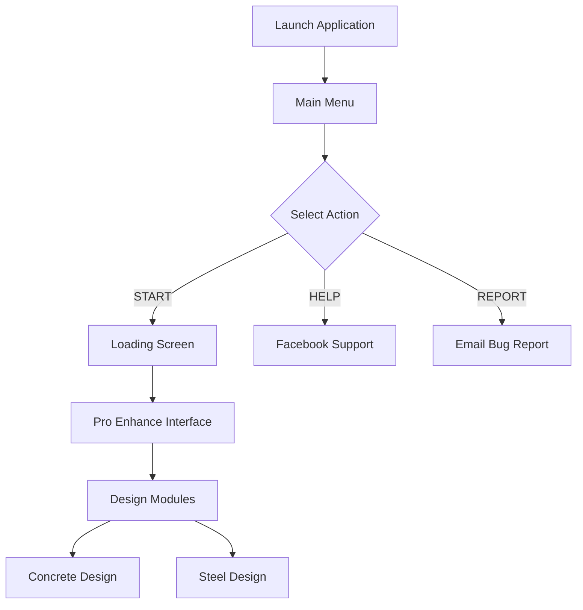

# 🏗️ XSTRUCT PRO ENHANCE v2

> Advanced structural engineering application with intuitive GUI interface

[](https://www.python.org/)
[](LICENSE)
[](https://www.linkedin.com/in/lsdg)

**XSTRUCT PRO ENHANCE v2** is a professional-grade structural engineering application featuring a modern GUI interface built with Python and Tkinter. It provides engineers with streamlined workflows for structural design, analysis, and documentation.

*Developed by* **Engr. Lowrence Scott D. Gutierrez**

---

## 🌟 Features

### 🎨 Modern User Interface
- **Sleek Design**: Custom-designed interface with professional graphics
- **Smooth Animations**: Loading screens with animated GIF transitions
- **Interactive Buttons**: Hover effects for enhanced user experience
- **Responsive Layout**: Centered windows with optimal screen positioning

### 🔧 Core Functionality
- **Concrete Design Module**: Specialized tools for concrete structural design
- **Steel Design Module**: Comprehensive steel structure analysis and design
- **Sample Files**: Pre-loaded STAAD and XSTRUC sample files for quick start
- **Report Generation**: Direct bug reporting via email integration
- **Help & Support**: Quick access to support resources via Facebook

### 💻 Technical Features
- **Resource Management**: Handles both frozen (PyInstaller) and development environments
- **Thread-Safe Operations**: Background loading for responsive UI
- **Image Optimization**: Efficient image loading and caching
- **Cross-Platform**: Compatible with Windows, macOS, and Linux

---

## 📋 Prerequisites

Before installation, ensure you have:

- **Python 3.8 or higher**
- **pip** (Python package manager)
- **Internet connection** (for initial setup and support features)

---

## 🚀 Installation

### 1. Clone the Repository

```bash
git clone https://github.com/SC0L0W/XSTRUCT_PRO_ENHANCE.git
cd XSTRUCT_PRO_ENHANCE
```

### 2. Install Required Dependencies

```bash
pip install pillow
```

> **Note**: `tkinter` comes pre-installed with Python on most systems.

### 3. Verify Project Structure

Ensure your directory structure matches:

```
XSTRUCT_PRO_ENHANCE/
│
├── main.py                          # Main application entry point
├── PRO_ENHANCE_INTERFACE.py         # Interface module
├── Icon.ico                         # Application icon
├── LICENSE                          # License file
├── README.md                        # This file
│
├── Design_Concrete/                 # Concrete design modules
├── Design_Steel/                    # Steel design modules
├── Mainmenu/                        # Main menu resources
│
├── Sample_STAAD_FILE/              # STAAD.Pro sample files
├── Sample_XSTRUC_FILE/             # XSTRUC sample files
│
├── images_mainmenu/                # Main menu graphics
│   ├── image_1.png
│   ├── image_2.png
│   ├── image_3.png
│   ├── image_4.png
│   ├── image_5.png
│   ├── image_6.png
│   ├── start_button.png
│   ├── start_button_hover.png
│   ├── report_button.png
│   ├── report_button_hover.png
│   ├── help_button.png
│   └── help_button_hover.png
│
├── images_sidebar/                 # Sidebar and loading graphics
│   └── loading.gif
│
└── images_staadpage/              # STAAD page graphics
```

---

## 💡 Usage

### Starting the Application

```bash
python main.py
```

### Main Menu Options

The application features three primary actions:

| Button | Function | Description |
|--------|----------|-------------|
| **START** | Launch Interface | Opens the main engineering interface |
| **HELP** | Get Support | Opens Facebook support page |
| **REPORT** | Report Bug | Opens email client to report issues |

### Navigation Flow




---

## 🎯 Key Components

### Main Window (`main.py`)
- Application entry point and main menu
- Manages window initialization and layout
- Handles button interactions and navigation
- Implements smooth transitions between screens

### Interface Module (`PRO_ENHANCE_INTERFACE.py`)
- Core engineering functionality
- Design calculation modules
- File management and processing
- Report generation capabilities

### Design Modules
- **Design_Concrete/**: Concrete structural design tools
- **Design_Steel/**: Steel structural design utilities

---

## 🔧 Building Executable

To create a standalone executable using PyInstaller:

```bash
pip install pyinstaller

pyinstaller --onefile --windowed --icon=Icon.ico --add-data "images_mainmenu;images_mainmenu" --add-data "images_sidebar;images_sidebar" --add-data "images_staadpage;images_staadpage" main.py
```

The executable will be created in the `dist/` folder.

---

## 🛠️ Troubleshooting

### Common Issues

| Issue | Solution |
|-------|----------|
| **Missing PIL/Pillow** | Install with: `pip install pillow` |
| **Images not loading** | Verify all image files exist in correct folders |
| **Icon not displaying** | Ensure `Icon.ico` is in root directory |
| **Loading screen stuck** | Check `PRO_ENHANCE_INTERFACE.py` exists and is importable |
| **Window not centered** | Update screen resolution settings |

### Debug Mode

To run with error output:

```bash
python -u main.py
```

---

## 📚 Documentation

### Code Structure

```python
# Main application flow
MainWindow.__init__()           # Initialize GUI
  ├── create_canvas()          # Setup visual elements
  ├── load_images()            # Load and cache images
  ├── create_buttons()         # Setup interactive buttons
  └── bind_events()            # Attach hover effects

show_loading_screen()          # Transition animation
run_main_task()                # Background operations
create_interface()             # Launch main interface
```

### Key Methods

- `get_resource_path()`: Resolves paths for bundled and development modes
- `show_loading_screen()`: Displays animated loading transition
- `open_email_client()`: Opens Gmail with pre-filled bug report
- `create_interface()`: Initializes the main engineering interface

---

## 🗺️ Roadmap

- [ ] Enhanced design calculation modules
- [ ] PDF report generation integration
- [ ] AutoCAD DXF export functionality
- [ ] Multi-language support
- [ ] Cloud storage integration
- [ ] Collaborative design features
- [ ] Advanced visualization tools
- [ ] Mobile companion app

---

## 🤝 Contributing

Contributions are welcome! Here's how you can help:

1. **Fork** the repository
2. **Create** a feature branch (`git checkout -b feature/AmazingFeature`)
3. **Commit** your changes (`git commit -m 'Add AmazingFeature'`)
4. **Push** to the branch (`git push origin feature/AmazingFeature`)
5. **Open** a Pull Request

### Development Guidelines

- Follow PEP 8 style guidelines
- Add docstrings to all functions
- Test on multiple platforms before submitting
- Update documentation for new features

---

## 📄 License

This project is licensed under the MIT License. See the [LICENSE](LICENSE) file for details.

---

## 👤 Author

**Engr. Lowrence Scott D. Gutierrez**

- 📧 Email: xstructures.lowrence@gmail.com
- 💼 LinkedIn: [@lsdg](https://www.linkedin.com/in/lsdg)
- 🐙 GitHub: [@SC0L0W](https://github.com/SC0L0W)
- 📘 Facebook: [@xstructures](https://www.facebook.com/@xstructures)

---

## 🙏 Acknowledgments

- **Python & Tkinter**: For providing robust GUI framework
- **Pillow (PIL)**: For advanced image processing capabilities
- **Structural Engineering Community**: For valuable feedback and support
- **Open Source Contributors**: For inspiration and best practices

---

## 📞 Support

Need help? Here are your options:

1. **Bug Reports**: Click the "REPORT" button in the app
2. **Facebook Support**: Visit [@xstructures](https://www.facebook.com/@xstructures)
3. **Email**: xstructures.lowrence@gmail.com
4. **GitHub Issues**: [Open an issue](https://github.com/SC0L0W/XSTRUCT_PRO_ENHANCE/issues)

---

## ⭐ Show Your Support

If you find this project useful:

- ⭐ Star this repository
- 🔄 Share with fellow engineers
- 🐛 Report bugs to help improve
- 💡 Suggest new features
- 🤝 Contribute to development

---

<div align="center">

**Built with 🔧 for Structural Engineers**

[Report Bug](https://github.com/SC0L0W/XSTRUCT_PRO_ENHANCE/issues) · [Request Feature](https://github.com/SC0L0W/XSTRUCT_PRO_ENHANCE/issues) · [Documentation](https://github.com/SC0L0W/XSTRUCT_PRO_ENHANCE/wiki)

</div>
